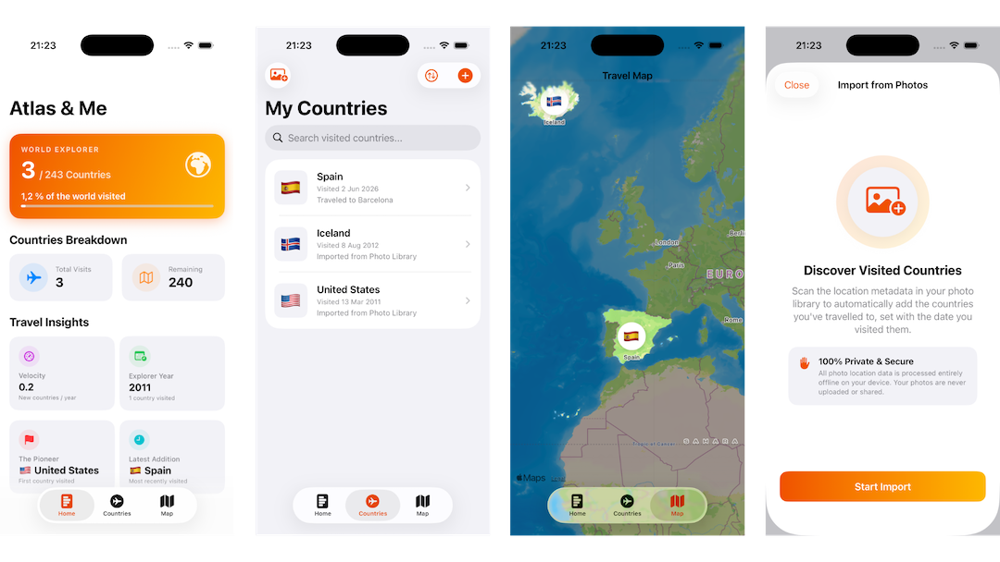

    

<h1 align="center">Atlas & Me</h1>

Track visited countries on a world map with personalized statistics

 

    
    
    

##

[Description](#-description) | [Usage](#-usage) | [Development](#-development) | [Contribution](#-contribution) | [License](#%EF%B8%8F-license)

## 📙 Description

**Atlas & Me** is an open-source, privacy-first visited countries journal and statistics tracker for iOS. It transforms your travel history into an interactive world map and provides deep insights into your global journeys. By leveraging local on-device processing, Atlas & Me can automatically reconstruct your travel timeline directly from your photo library while processing your personal data locally on your device.

### Features

- **Interactive World Map:** Visualize your journeys on a world map that highlights visited countries while keeping unvisited ones visible for your next adventure.
- **Personal Travel Journal:** Record the exact date of your first visit and log personal notes for every country.
- **Instant Photo Library Import:** Skip the manual data entry. The app securely scans your local photo library's metadata to automatically detect visited countries and their exact dates.
- **Deep Travel Insights:** Generate comprehensive statistics, including:
  - Percentage of the world explored
  - Country visit velocity (average countries per year)
  - Your most traveled year
  - Milestone tracking (your very first and most recent countries visited)

### Screenshots

### Use of AI

**AI disclaimer:** The code of this app is almost entirely vibe-coded. While most of the code was manually reviewed
and both fundamental design choices and a lot of UI design choices were made by humans, the algorithms implemented might not be the most performant ones, but they work quite well. The translations for this app are also initially generated by AI,
but everyone is more than welcome to contribute changes for their native language so the translations sound more natural.

## 🖥 Usage

An official beta release is available for download on [TestFlight](https://testflight.apple.com/join/exSQGw9j).
The latest, unsigned build artifact of the app can be downloaded and installed from the releases page.

Once started, you can begin collecting countries in the country tab of the app
by either adding them manually to the list or automatically importing them from your photo library.
Based on the countries added, the app will automatically generate statistics and a world map highlighting
your visited countries.

## 🧑‍💻 Development

Atlas & Me is a native iOS app developed using Swift and SwiftUI.
It uses SwiftData to store the visited countries.
Thanks to its simplicity, no dependencies are required, and the app can just be built as an Xcode project.

Before committing code, two mandatory checks need to be executed:

Lint code using SwiftLint: `swiftlint lint .`  
Format code style using SwiftFormat: `swiftformat .`

Both tools can be installed using [Homebrew](https://brew.sh) (`brew install swiftlint` and `brew install swiftformat`), as done in the [CI pipelines](https://github.com/jarne/atlas-me/blob/main/.github/workflows/lint-code.yml).

## 🙋‍ Contribution

Contributions are always very welcome! It's completely equal if you're a beginner or a more experienced developer.

Thanks for your interest 🎉👍!

## 👨‍⚖️ License

[MIT](https://github.com/jarne/atlas-me/blob/main/LICENSE)
